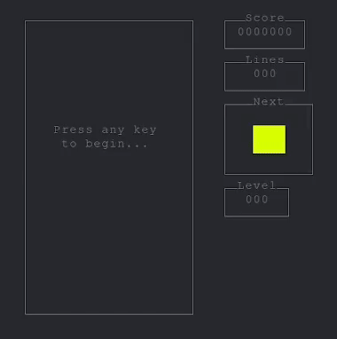

# Terminal Tetris Clone

I wanted to improve my skills in C and GDB so I wrote this classic Tetris clone that runs in the terminal, written in C using ncurses.  Plays best with a high key repeat rate and low repeat delay.

## Supported Enviroments

- GNU/Linux
- Windows via WSL
- Untested on Mac

## Required Tooling

### CMake

&nbsp;&nbsp;&nbsp;&nbsp; *CMake is the de-facto standard for building C++ code.*

- [CMake.org](https://cmake.org/)

### GCC

&nbsp;&nbsp;&nbsp;&nbsp; *The GNU Compiler Collection includes front ends for C, C++, Objective-C, Fortran, Ada, Go, D, Modula-2, and COBOL as well as libraries for these languages (libstdc++,...).*

- [gcc.gnu.org](https://gcc.gnu.org/)

## External Dependencies

### NCurses

&nbsp;&nbsp;&nbsp;&nbsp; *NCurses (new curses) is a programming library for creating textual user interfaces (TUIs) that work across a wide variety of terminals.*

- [gnu.org/software/ncurses](https://www.gnu.org/software/ncurses/)

### Unity

&nbsp;&nbsp;&nbsp;&nbsp; *Unity is a Unit-Testing framework written in 100% pure ANSI C.*

- [throwtheswitch.org](https://www.throwtheswitch.org/unity)

## Basic Build Instructions

### Building with Unit Tests

1. Clone this repo. `git clone https://github.com/AustinBachurski/Tetris.git`
1. Change to the Tetris directory. `cd Tetris`
1. Configure CMake. `cmake -B build -S . -DRUN_TESTS=YES`
1. Build the project. `cmake --build build`
1. Run the unit tests. `ctest --test-dir build --verbose`
1. Play the game. `./build/bin/tetris`

### Building without Unit Tests

1. Clone this repo. `git clone https://github.com/AustinBachurski/Tetris.git`
1. Change to the Tetris directory. `cd Tetris`
1. Configure CMake. `cmake -B build -S .`
1. Build the project. `cmake --build build`
1. Play the game. `./build/bin/tetris`

## Controls

- The game can be quit at any time by pressing `ctrl + c`.
- Key bindings can be adjusted by editing the switch statement in `src/game/input.c` and recompiling.
- At present, controls are hard coded for use with the Colemak layout that I use as follows:

| Move Left | Move Right | Move Down | Rotate |
| --------- | ---------- | --------- | ------ |
| &nbsp;&nbsp;&nbsp;&nbsp;&nbsp;&nbsp;`R` | &nbsp;&nbsp;&nbsp;&nbsp;&nbsp;&nbsp;&nbsp;&nbsp;`T` | &nbsp;&nbsp;&nbsp;&nbsp;&nbsp;&nbsp;&nbsp;&nbsp;`S` | &nbsp;&nbsp;&nbsp;&nbsp;`F` |

